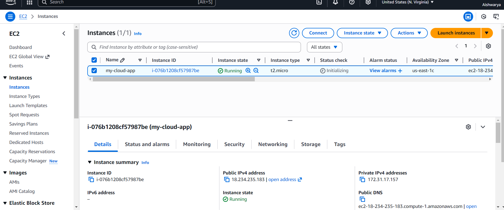
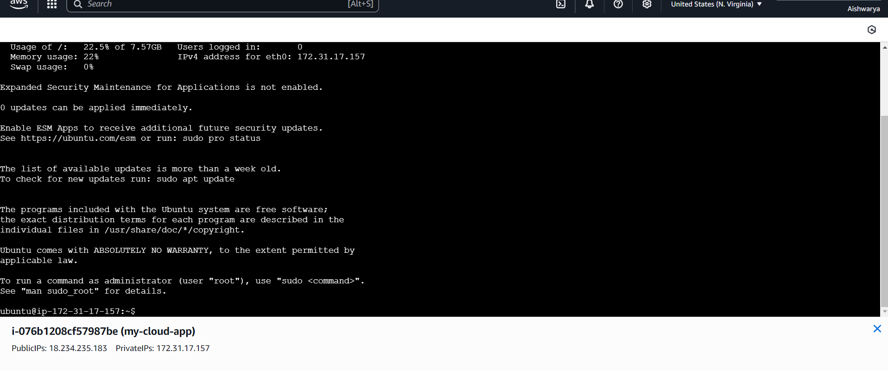
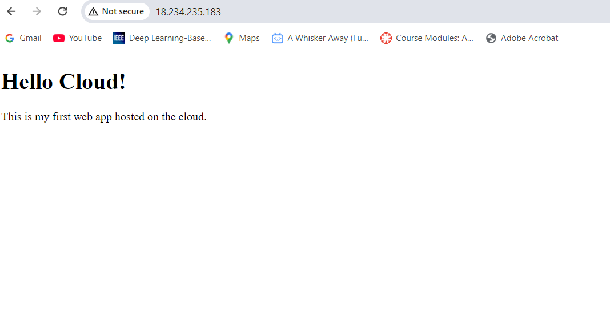

# AWS-WebApp-Deployment
# Task 6: Host and Deploy a Web Application on the Cloud

## Objective
The aim of this task is to deploy a simple web application on a cloud platform (AWS) using an EC2 instance. This helped me understand the process of hosting, public access, and web server setup.

## Tools Used
- Amazon Web Services (AWS)
- EC2 (Ubuntu 22.04)
- Apache Web Server
- Notepad
- Web Browser
- GitHub

## Project Files
- index.html – Simple web application file
- EC2-console-screenshot.png – EC2 instance running
- Terminal-screenshot.png – Apache installation
- Browser-live-site-screenshot.png – Web app running live in browser

## Steps

### Step 1: Create a simple web application
Created a file named index.html using Notepad and saved it locally.

### Step 2: Launch an EC2 instance on AWS
- Logged in to AWS Console and launched a new EC2 instance.
- Selected Ubuntu 22.04 LTS (Free Tier eligible).
- Instance type: t2.micro.
- Allowed HTTP and SSH traffic.
- Created and downloaded the key pair (.pem).
- Launched the instance successfully.

### Step 3: Connect to the instance
Used EC2 Instance Connect (browser terminal) to connect to the running instance.

### Step 4: Install Apache web server
sudo apt update

sudo apt install apache2 -y

sudo systemctl start apache2

sudo systemctl enable apache2

### Step 5: Deploy the web application
Opened the default web directory and replaced the HTML file:
sudo nano /var/www/html/index.html


Pasted my HTML code, saved the file, and restarted Apache:
sudo systemctl restart apache2

### Step 6: Access the web application
Copied the Public IPv4 address of the instance and opened it in the browser:
http://<public-ip>

php-template
The page loaded successfully with the message:
“Hello Cloud! This is my first web app hosted on the cloud.”

### Step 7: Take screenshots
1. EC2-console-screenshot.png – EC2 instance running  
2. Terminal-screenshot.png – Apache installed  
3. Browser-live-site-screenshot.png – Live web page visible  

## Screenshots
| Screenshot | Description |
|-------------|--------------|
|  | EC2 instance running |
|  | Apache installation |
|  | Web app live in browser |

## Outcome
By completing this task, I learned how to:
- Deploy a web app on AWS EC2
- Configure and manage a web server
- Make an app accessible publicly
- Understand basic cloud hosting steps

## Author
Aishwarya Kopulwar  
Cloud and Linux Engineer Intern  
GitHub: [Aishwarya-k1155](https://github.com/Aishwarya-k1155)

## Source Code
```html
<!DOCTYPE html>
<html>
<head>
  <title>My Cloud App</title>
</head>
<body>
  <h1>Hello Cloud!</h1>
  <p>This is my first web app hosted on the cloud.</p>
</body>
</html>
